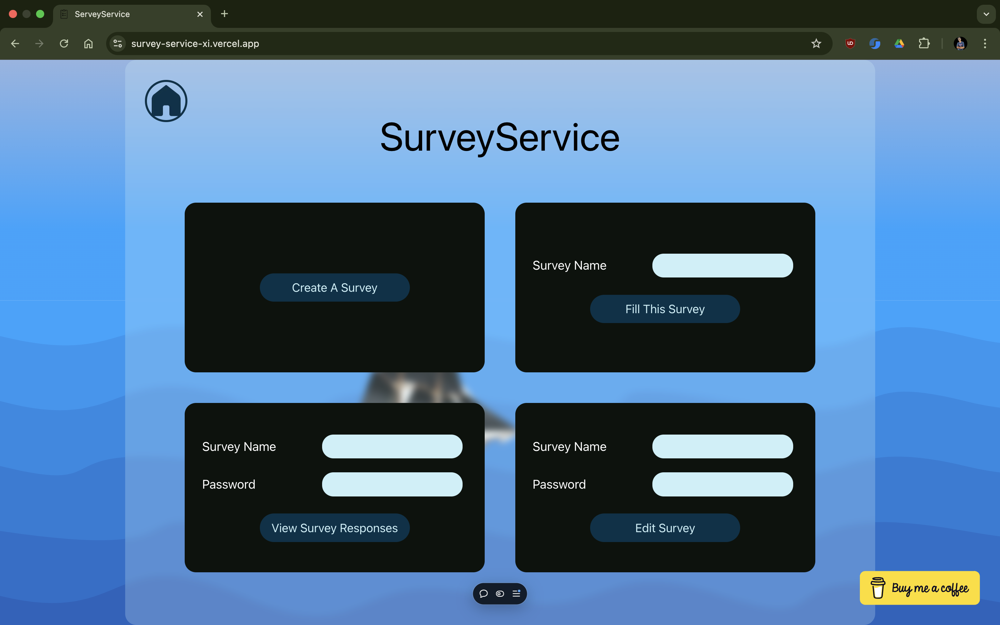
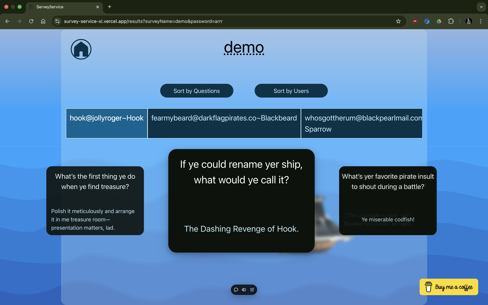
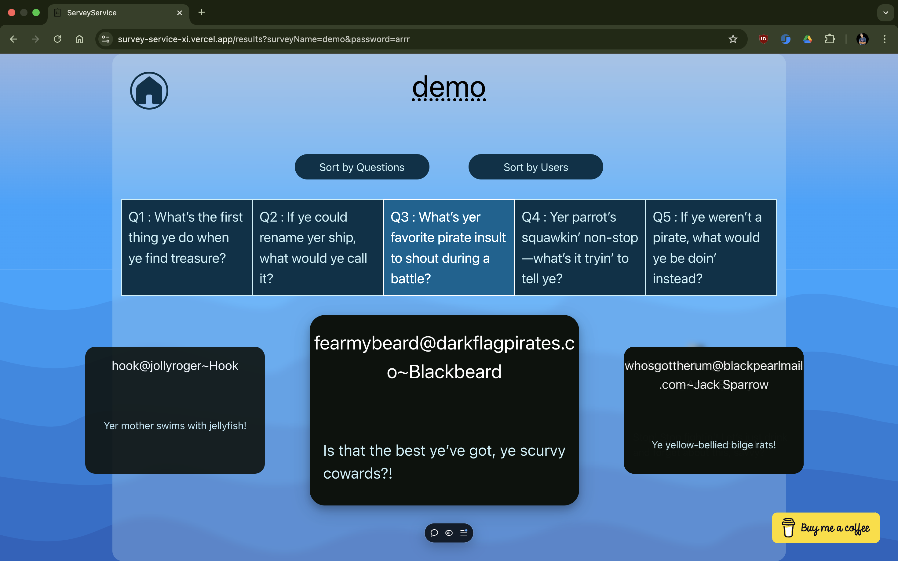
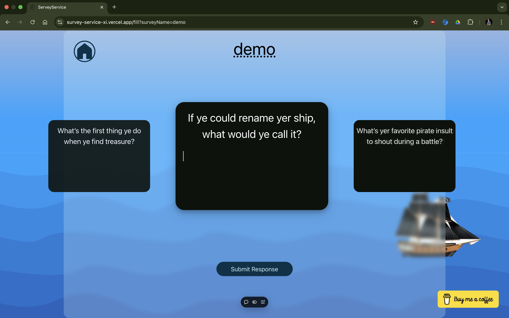
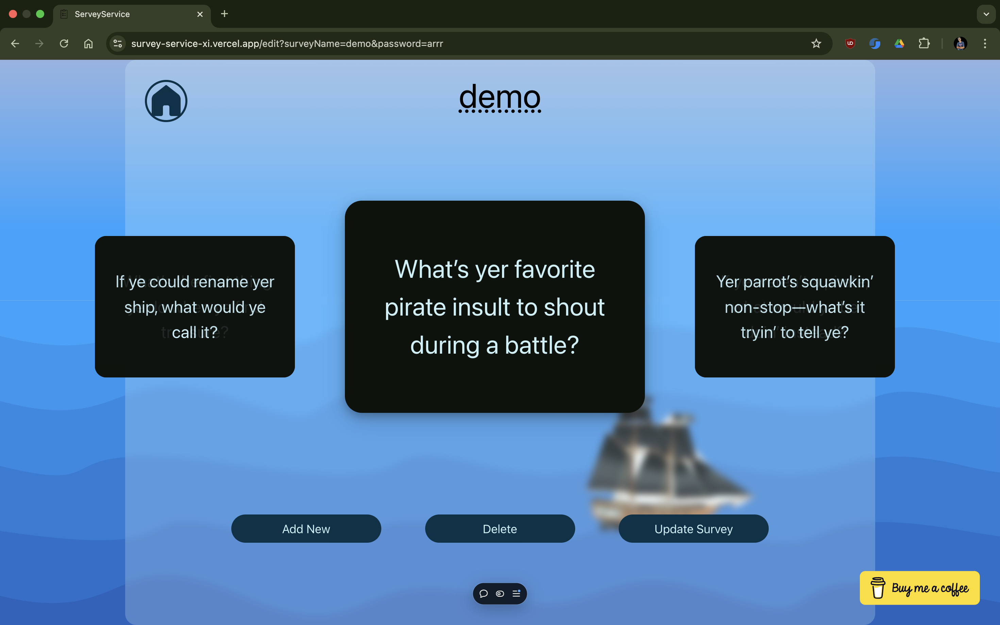
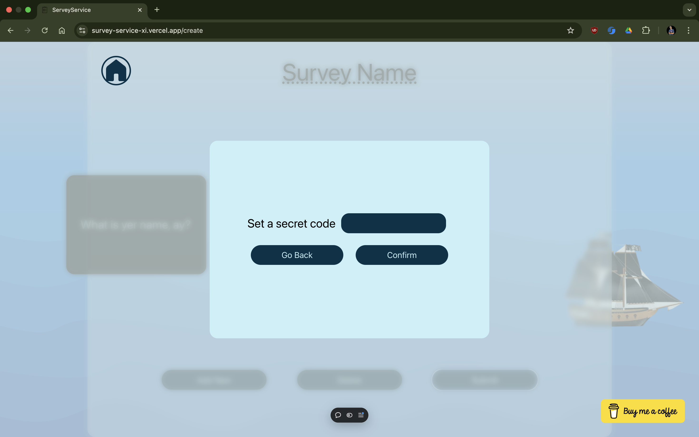
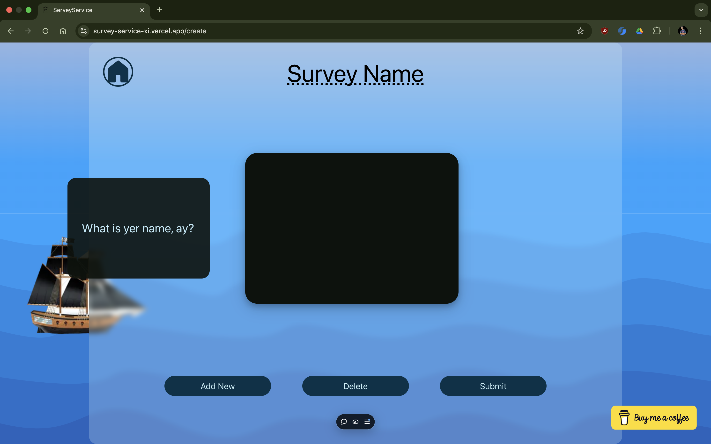

# SurveyService
My first project with reactjs, I decided to not read docs or follow any tutorial and jump in headfirst and make something. Fight the problems that come along the way and hopefully end up with something great. That is exactly what happened and I have come out with a survey platform that allows users to make questionaires / quizzes or surveys. These can be shared easily and their responses viewed.
I hope you like the app. I'm always open for feedback and would actually like to hear from you.

## How to run

A demo survey has been created and populated with data.

<b>name: "demo", password: "arrr"</b>

Visit the website [https://survey-service-xi.vercel.app](https://survey-service-xi.vercel.app)

- Create a survey 
   - Set a unique survey name.
   - Add as many questions as you want.
   - Click on Submit
   - Set a secret code to access the survey. (Please set this code trivial. It is NOT properly secured)
   - Click on Confirm. The survey will be saved and you will be redirected to the home page in 5sec.
   - Share the survey name with the people you want to answer the survey.
- Edit a Survey
   - Fill in the survey name and secret code for editing the survey and click the button.
   - Edit the survey. Make any changes you want. Click on Submit.
   - You will be asked for a new code, the code you enter now will be updated. You can chose to keep the old code. 
- Answer a survey
   - Fill in the survey name you want to fill and click click the button.
   - Answer the questions and click on Submit Response.
   - Fill your details - name and email. Click on yes.
   - You will be redirected to the home page in 5sec.
- View survey results
    - Fill in the survey name and secret code for viewing the survey results and click the button.
    - You will see the survey results.
    - You have the option to sort by users or questions.
    - On sort by users, you can see the responses of each user in sequence.
    - On sort by questions, you can see the responses of all users for that questions.

## Screenshots

## Tech Stack
- Frontend: React, Next.js
- Database: Firebase Firestore
- Hosting: Vercel

## Features
- State management using React Context API
- Firebase Firestore for storing survey data
- Navigation and Image Optimization using Next.js
- Responsive design using Tailwind CSS
- Animations designed in CSS

This is my first project with React.js, Next.js and Firebase firestore and after numerous refactorisations, redesigns, and a lot of challenges, looking back I am proud of how it turned out and how much I learned from this project.
